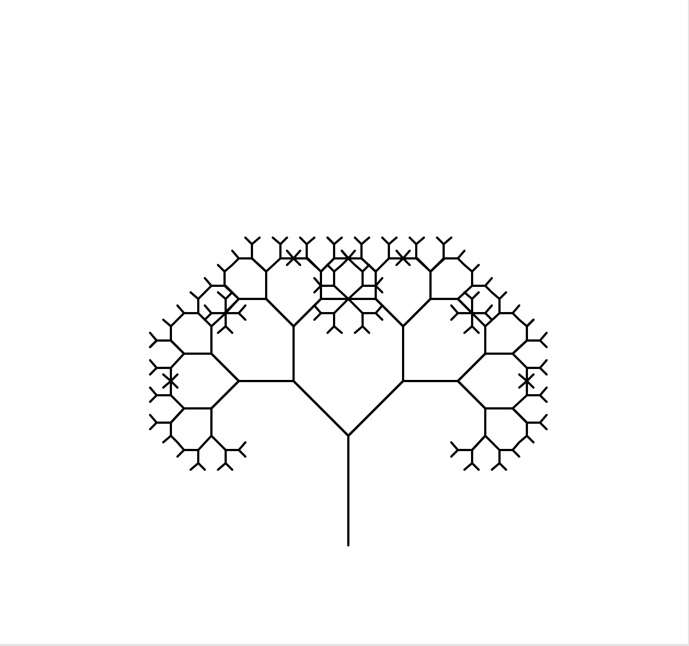
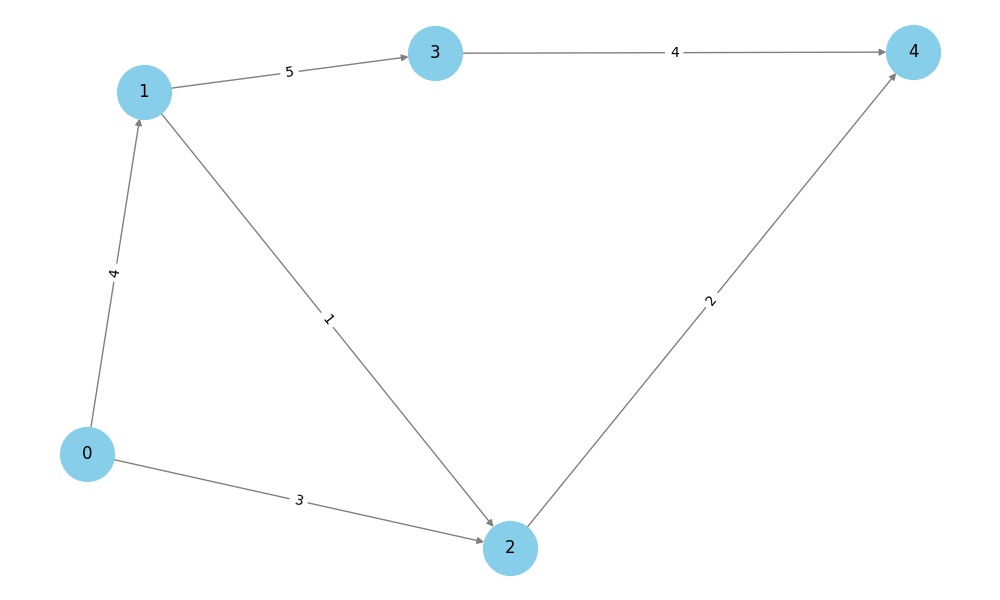
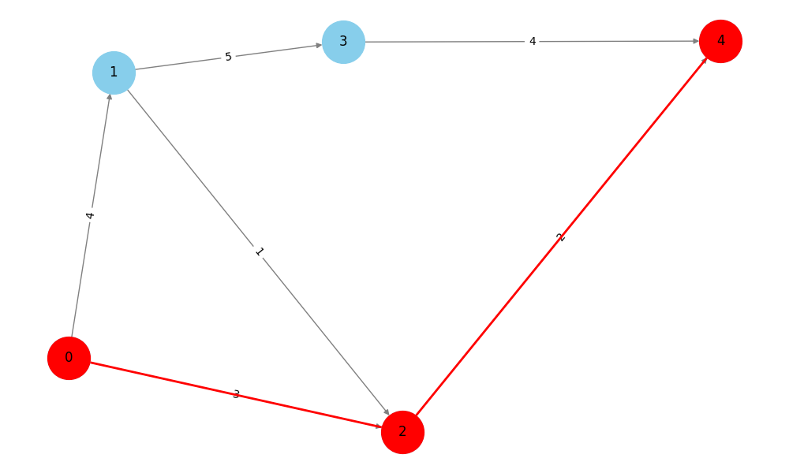
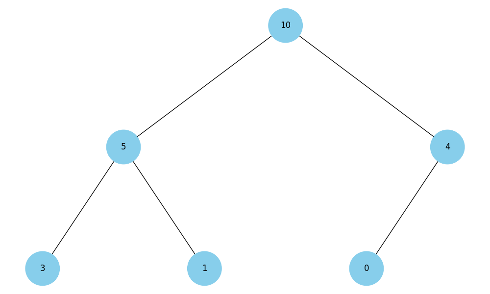
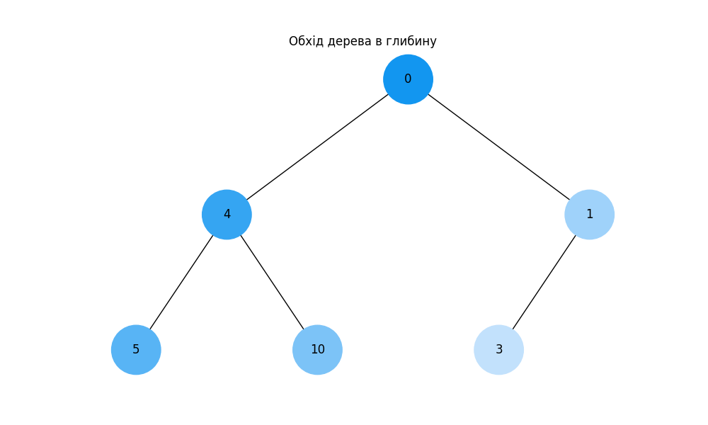
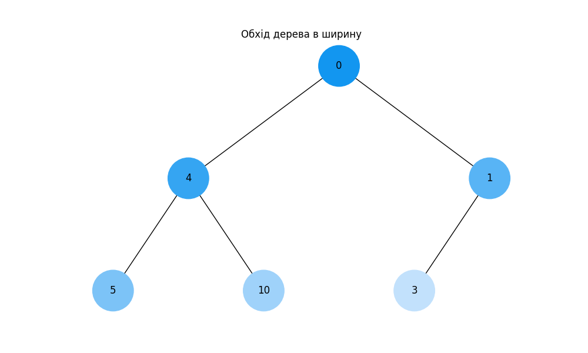

# goit-algo-fp
Final project

**Завдання 1. Структури даних. Сортування. Робота з однозв'язним списком**
======================================================================================
**Тестові результати**
--------------------------------------------------------------------------------------

Заданий список:
15 10 5 20 25 

Реверсований список:
25 20 5 10 15 

Відсортований список (Список 1):
5 10 15 20 25 

Додатковий відсортований список (Список 2):
1 2 3 4 26 27 28 29 30 

**************************************************************************************
**************************************************************************************

**Завдання 2. Рекурсія. Створення фрактала “дерево Піфагора” за допомогою рекурсії**
======================================================================================
**Тестовий результат**
--------------------------------------------------------------------------------------

Рівень рекурсії: 8

**************************************************************************************
**************************************************************************************

**Завдання 3. Дерева, алгоритм Дейкстри**
======================================================================================
**Тестовий результат**
--------------------------------------------------------------------------------------

Візуалізація зваженого графу

Візуалізація найкоротшого шляху від вершини 0 до вершини 4

**Найкоротші шляхи від вершини 0 до інших вершин**

* Найкоротший шлях від 0 до 0: 0
* Найкоротший шлях від 0 до 2: 3
* Найкоротший шлях від 0 до 1: 4
* Найкоротший шлях від 0 до 3: 9
* Найкоротший шлях від 0 до 4: 5

**************************************************************************************
**************************************************************************************

**Завдання 4. Візуалізація піраміди**
======================================================================================
**Тестовий результат**
--------------------------------------------------------------------------------------

Візуалізація бінарної купи

**************************************************************************************
**************************************************************************************

**Завдання 5. Візуалізація обходу бінарного дерева**
======================================================================================
**Тестовий результат**
--------------------------------------------------------------------------------------

Візуалізація обходу дерева в глибину

Візуалізація обходу дерева в ширину

**************************************************************************************
**************************************************************************************

**Завдання 6. Жадібні алгоритми та динамічне програмування**
======================================================================================
**Тестовий результат**
--------------------------------------------------------------------------------------